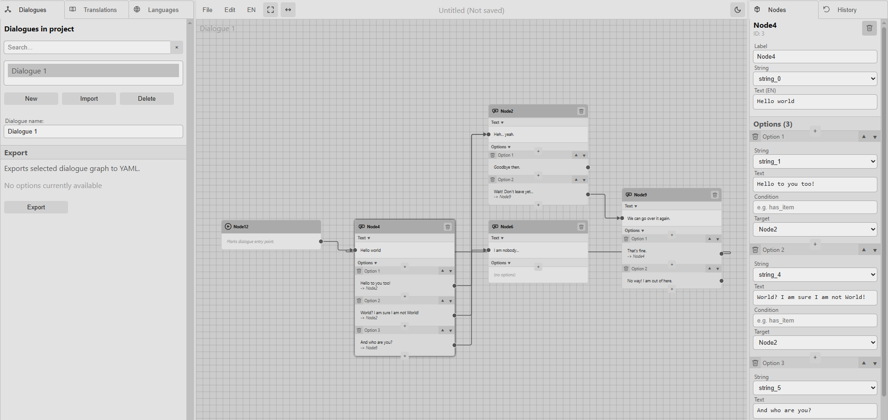

# DATFlow 0.1.2

Engine-agnostic dialogue authoring tool made with Vue and Vueflow.

DAT stands for Dialogue Authoring Tool, Flow indicates that it was made with VueFlow library.



**You can try it here:** https://maximryzhov.github.io/

No login required. All data is saved in your local storage and can be downloaded to your device.

## What it can do
- Run in browser
- Build dialogue trees with three types of nodes: Dialogue, Branch and Script
- Add translations for multiple languages
- Export dialogue trees to YAML files and import back
- Export translation tables to CSV and import back
- Save whole project to JSON on your device
- Autosave in your localStorage
- Undo/Redo for node actions (not for text fields though)

## What it can't do
- Run dialogue files for you
- Validate scripts and expressions

## Runtime implementations:
- Unity 3D: https://github.com/maximryzhov/datflow-unity

## FAQ
### Why it exists?
NIH syndrome. There are plenty options out there: Yarn Spinner, Articy Draft, Ink, Twine. They were too opionated for my taste, so I decided to develop my own format and own tool.

### How translations work?
Each string has a unique label. Strings can have as many translations as you want, or can have just one translation. 

Strings can be edited in the "Translations" tab, or in the Node inspector (for the selected language only). The currently selected language can be changed in the main menu. 

The dialogue trees and the string table are independent in the project. You can create multiple dialogues in your project, then export CSV table with your text strings and give it to your translator to add more languages, then import again.

If the imported CSV has the same string names that are already in your project, they will be silently overwritten.

### How does Dialogue node work?
Dialogue node has a reference to a string in the string table. Strings can be reused multiple times across multiple dialogues and dialogue nodes.

Dialogue node can have 0 or more options. Each option has a reference to a string in a string table. Each option can have a condition expression that may be evaluated in your engine of choice.

By design:
- an option should be shown if its condition expression evaluates to `true` or it doesn't have a condition
- if there's only one option, your engine should interpret it as the default option (useful for autoplaying dialogues)
- if there's no text for the option, your engine should interpret as the default text, e.g. "Continue"
- if there is no options, your engine should interpret as the end of the dialogue. There is no dedicated "End" node.

Options can be reordered by dragging and dropping or with "up" and "down" buttons.

### How does Branch node work?
Branch node can have multiple options, the same as the Dialogue node. Each option can have an expression. By design, the first expression that evaluates to `true` determines which node will be selected next. It is up to your engine to interpret the expression. It may be the same script language your game uses or a lightweight safe DSL for evaluating conditions.

### How does Script node work?
DATFlow doesn't ship with a scripting language or interpreter. It is up to your engine to interpret the code in the Script node, should it be the actual code or a filename that contains the actual code.

### How do I add character name, portraits, voice files?
Currently there is no way to do this. There is a planned feature to add editable user data to any node, so you can add your own text, numbers and flags to a node.

### Why YAML?
I needed a dialogue format that can be easily authored and edited with the text editor as well as with a visual tool. With DATFlow, a dialogue can look like this:
```yaml
Node4:
  type: dialogue
  text: string_0
  options:
    - next: Node2
      text: string_1
    - next: Node2
      text: string_4
    - next: Node6
      text: string_5
Node2:
  type: dialogue
  text: string_2
  options:
    - text: string_7
    - next: Node9
      text: string_8
Node6:
  type: dialogue
  text: string_6
Node9:
  type: dialogue
  text: string_9
  options:
    - next: Node4
      text: string_10
    - text: string_11
Node12:
  type: start
  options:
    - next: Node4
```
It is very human-readable and could be easily edited with a simple text editor. With JSON or XML it would be more challenging.

## Roadmap
- [x] Write a C# runtime
- [ ] Write a Python runtime
- [ ] Write a JS runtime
- [ ] Add user data to nodes
- [ ] Add Custom type node
- [ ] Bulk export of dialogue files
- [ ] Export dialogues to JSON
- [ ] Add a simple code editor for Script node
- [ ] Delete connections with mouse or Delete key
- [ ] Clone/copy nodes
- [ ] Collapse sections in the Node inspector panel
- [ ] Drag choices in the Node inspector panel
- [ ] Add a playtesting environment with dummy variables and functions

## Known bugs
- Drag-panning can freeze due to unknown reason
- Undo/Redo with keyboard (Ctrl+Z/Ctrl+Y) may result in undoing/redoing 2 steps for some operations

## License
You can copy, modify and distribute the source code if you provide the link to the original source and as long as the resulting product stays non-commercial and ad-free.

You can use content created with this tool without any restrictions. 